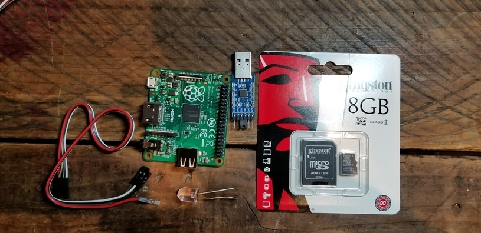
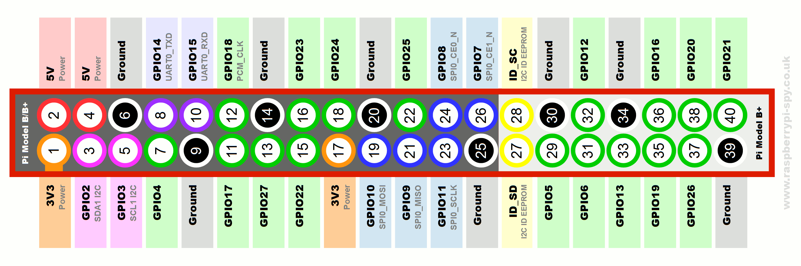
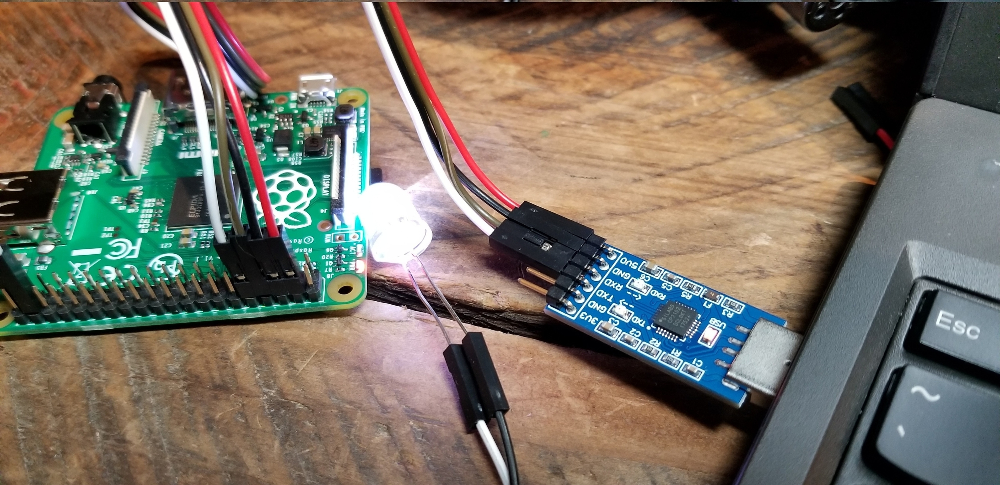

### Lab: make sure R/pi hardware and its toolchain works.

Make sure you start with the [prelab](PRELAB.md).

There's a lot of fiddly little details in getting a pi working, and
this lab is many people's first time working with hardware, so we break
the lab down into many (perhaps too-many) small steps.   Our theorem:
the smaller the step, the more obvious what the actual (distal) error is
and the less time you have to spend debugging.

We'll use different variations of a blinky light using GPIO pin 20 
(second from bottom on the right):

  1. you'll turn on an LED manually;
  2. then use a pre-compiled program (why not skip 1?);
  3. then use a bootloader (why not skip 2?);
  4. then install the r/pi tool chain, compile a given assembly
	   version and use it (why not skip 3?);
  5. then write your own and compile: this is the fun part.  It's also
	the longest (why not skip 4?).

The final sign off for the lab:

  1. Show you have a working `blink` compiled using the tool chain and started
     using the bootloader.
  2. Bonus: Give example problems you ran into (or someone you helped
     ran into) and how you solved them.  If these get put into the
     `README.md` you'll get a fantastic prize!

--------------------------------------------------------------------------
### Life and death rules for pi hardware.

Always:

  1. Whenever you make a hardware change --- messing with wires,
     pulling the SD card in/out --- ***make sure pi is disconnected***.
     It's too easy to short something and fry your hardware.  Also,
     pulling the SD card out while under power appears to sometimes
     cause corruption.

  2. While you've maybe never worked with a pi, it's just like anything
     else in the sense: if it's not responding, unplug it (remove power)
     and reconnect.

  3. If anything ever gets hot --- the serial device, the pi ---
     ***disconnect***.  Sometimes devices have manufacturing errors
     (welcome to hardware), sometimes you've made a mistake.  Any of
     these can lead to frying the device or, in the worst case, your
     laptop.  So don't assume you have a safety net: its up to you to
     avert disaster.

--------------------------------------------------------------------------
#### 0. Make sure you have everything.

Pick up:
  1. a R/PI A+;
  2. a microSD card and adapter;
  3. a CP2102 USB-TTL adapter;
  4. however many led's you want;
  5. some female-female jumpers;
  6. printout of the pi's pins.

<table><tr><td>
  
</td></tr></table>

--------------------------------------------------------------------------
#### 1. Make sure hardware is working:

Before we mess with software, we first make sure the hardware works.  When doing
something for the first time, you always want to isolate into small pieces.

Use the USB-TTY to power the pi, and use the pi's power to directly
turn on an LED.  This tests some basic hardware and that you know how to
wire.

<table><tr><td>
  
</td></tr></table>

Mechanically:
  1. Connect the USB-to-TTL Serial cable's power (red) and ground  (black)
     wires to the 5v and ground pins on the pi that are next to each other
	(see your printout; upper right corner).
  2. Plug the USB-TTY into your USB port.
  3. Connect  your LED up to another ground pin and the 3v power pin (there are
     several) to make sure the hardware components work, and you know how
     get them to.  If the LED doesn't go on, reverse its connections.
     If still doesn't go on, plug someone else's working version into
     your computer.  If that doesn't work, ask.

(EE folks: We don't use a breadboard b/c it's bulky; we don't use
resistors for the same reason + the LED is big enough we generally don't
fry it.)

What can go wrong:
  1. If your USB-to-TTL starts heating up, disconnnect!   It appears that 1 in 8
  is defective.   
  2. If your pi starts heating up, now or ever, disconnect!   If you have a short,
  where a pin with power feeds right into ground, you'll fry it.

--------------------------------------------------------------------------
#### 2.  Make sure you're able to install firmware, etc:

You'll run a precompiled program (`part1/blink-pin20.bin`) on the pi and make
sure it can blink pin 20.

Note: in the next assignment  when you develop your own remote bootloader
(see next step), if your code is broken you'll need to use this SD
card method to load a new version, so pay attention to how you do it on
your computer.

Mechanically:
  1. Unplug the USB-TTY.
  2. Plug SD card into your computer and figure out where it's mounted.
  3. As discussed in the `PRELAB`, copy all the files from class `firmware` directory onto the SD card (`cp firmware/* /<sdcard path>/`)
  4. copy `part1/blink-pin20.bin` to the SD card as `kernel.img`.
  5. type `sync` and then eject the SD card (don't just pull it out!  data may not be written out.)
  6. connect the LED to GPIO20 and ground. 
     Use `docs/gpio.png` to figure out which this is.
  7. Plug the SD card into your pi
  8. Plug in the USB-TTY to your USB to power the pi.  The pi will jump
  to whatever code is in `kernel.img`.

The LED should be blinking.  If you get this working, please help anyone
else that is stuck so we all kind of stay about the same speed.

Troubleshooting:
   0. First try to trouble shooting from part 1.
   1. If it's not blinking, swap in someone else's card that is working.
   2. If that works, compare their SD card to yours.
   3. If that doesn't work, try your card in their rpi.  

--------------------------------------------------------------------------
#### 3.  Send a new pi program from your computer rather than SD card.

As you've noticed, running new programs on the pi using the SD card
method is tedious.  This step shows makes it so you can send programs
directly from your computer to a plugged-in pi.

Method: install a program (which we somewhat inaccurately call a
"bootloader").   This program will wait on the pi for a program sent by
your computer, copy it into pi memory, and then jump to it.  We currently
give you a pre-compiled version (`firmware/bootloader.bin`).

<table><tr><td>
  
</td></tr></table>

Mac:
  - Download and install the drivers for a
   CP210x USB-to-UART driver as described in the 
   [cs107e docs](http://cs107e.github.io/guides/install/mac/).
   - Make sure you reboot after doing so.

Linux:
  - You shouldn't need drivers, however you may need to add yourself to
    the `dialout` group (or `serial`) depending on the distribution.

        sudo adduser <your username> dialout

    If that still doesn't work, you may have to remove `modemmanager`:

        sudo apt-get remove modemmanager

Mechanically:

  0. Unplug your pi. Don't modify your current wiring.
  1. Copy `firmware/bootloader.bin` on your SD card as `kernel.img` (see a 
 	pattern?).
  2. Hook the TX and RX wires up to the pi.  Do you TX/TX and RX/RX or
     switch them?  (Hint: Think about the semantics of TX (transmit)
     and RX (receive).)
  3. Copy `bin/pi-install.linux` or `bin/pi-install.macos` to your
     local `bin/pi-install`.  Make sure when you type `pi-install`
     something happens!  If not, make sure your local `bin/` directory
     is in your path, and that you have sourced your shell startup file.
  4. Run `pi-install part1/blink-pin20.bin`

Your LED should be blinking.

--------------------------------------------------------------------------
#### 4.  Make sure your r/pi toolchain is working.

For this class you need to compile bare-metal r/pi programs on your
computer, which is most likely not a bare-metal r/pi itself.  Thus we
need to set up the tools needed to `cross-compile` r/pi programs on
your computer and to r/pi binaries.

Install the toolchain:
   -  For a mac use the [cs107e install notes](http://cs107e.github.io/guides/install/mac/).  Note: do not install the python stuff.

   -  For [ubuntu/linux](https://github.com/eistec/mulle/wiki/Installing-toolchain-%28GCC%29):

           sudo add-apt-repository ppa:team-gcc-arm-embedded/ppa
           sudo apt-get update
           sudo apt-get install gcc-arm-none-eabi
       
      You may also have to add yourself to the `dialout` group.
      If gcc can't find header files, try:

           sudo apt-get install libnewlib-arm-none-eabi

Compile `part2/blink-pin20.s` using the shell script.

   1. `cd part2`.   Run `sh make.sh`. We will use `make` frequently in the future to compile our code before sending if off to the pi. If you don't know what `make` does, or how a `Makefile` works, see the [CS107E Guide to Make](http://cs107e.github.io/guides/make/).
   2. reset your pi: unplug the TTY-USB then plug it back in to your laptop.
   3.  `pi-install part2/blink-pin20.bin`.   Should blink.  If
	not isolate the problem by trying the blink-pin20.bin in `part1/`,
	your lab partner's, etc.

