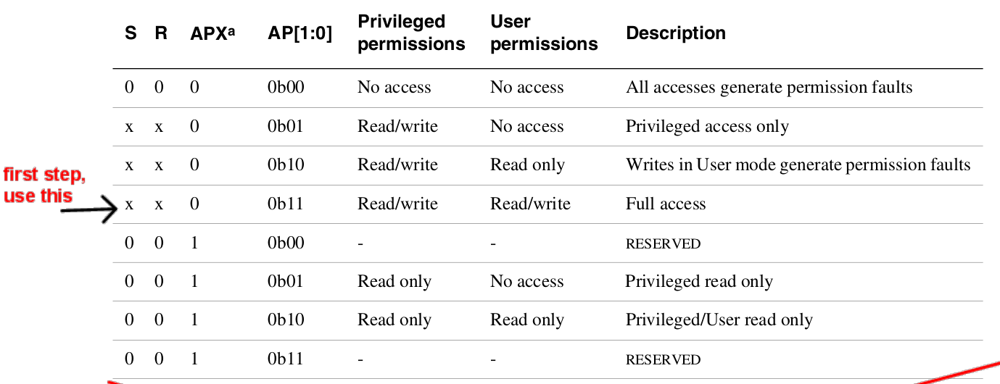
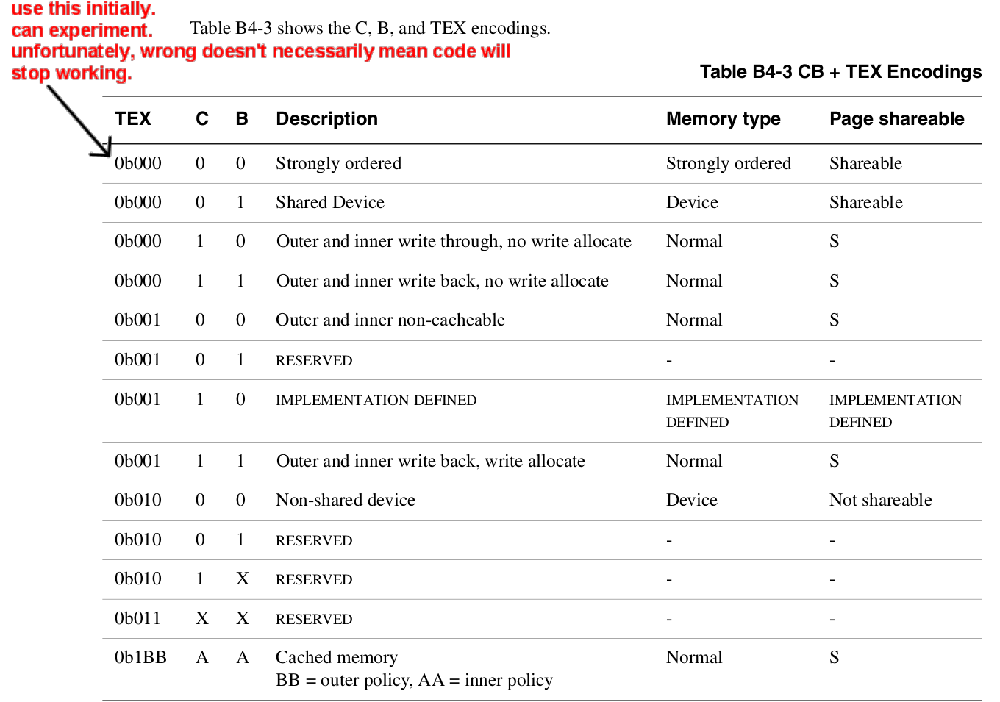
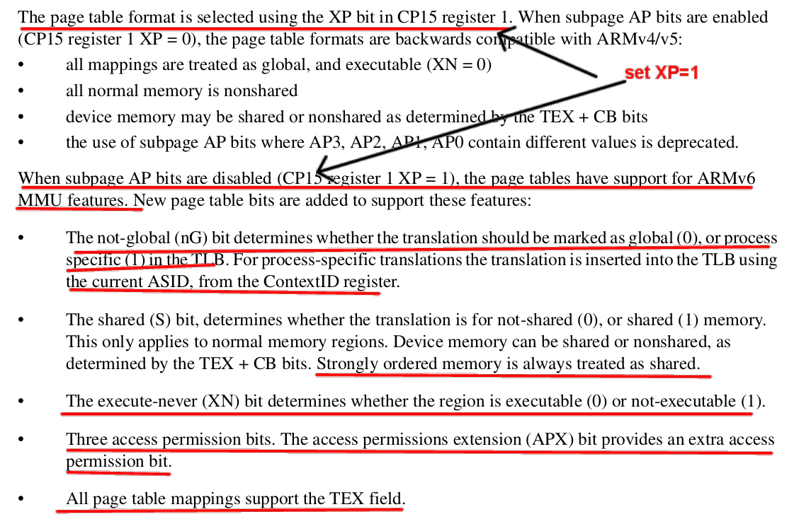

## Simple virtual memory.

Today you'll get a simple "hello world" version of virtual memory
working.  The background reading and intutive chit-chat is in the
[PRELAB.md](PRELAB.md).  Since there's a lot going on today, the lab
`README.md` has been stripped down to mostly mechanical instructions so
you have more time to look at the code.

As with the FAT32 lab, since there are a bunch of data structures (in this case
for the machine state) there's a bunch of data structure code.   The rough
breakdown:

   - `our-*.o`: these are the object files we give you to get you
     started. As with fat32, you can view today's and wednesday's labs
     as fetchquests for how-do-I-do-X where the goal is to implement
     everything yourself and delete our implementations.

  - `vm.h`: this has the data structures we will use today.   I've tried to comment
    and give some page numbers, but buyer beware.    

  - `vm-helpers.c`: these contain printing and sanity checking routines
    (same as in the fat32 lab).

  - `arm-coprocessor-asm.h`: has a fair number of instructions used to access the
    privileged state (typically using "co-processor 15").  Sometimes the arm docs
    do not match the syntax expected by the GNU assembler.  You can usuaully figure
    out how to do the instruction by looking in this file for a related one so you
    can see how the operands are ordered.

   - `docs/README.md` gives a rundown of where some key registers / machine state
     is defined.  In general, if the page numbers begin with a `b` they
     are from the armv6 general documents (the pdf's that begin with
     `armv6` such as `armv6.b2-memory.annot.pdf`) Without a letter prefix
     they come from the `arm1176*` pdf's.

#### Check-off

You need to show that:
  1. You replaced all `our_mmu_*` routines with yours and everything works.
  2. You can handle protection and unallowed access faults.

------------------------------------------------------------------------------
#### Virtual memory crash course.

You can perhaps skip this, but to repeat the pre-lab:

 - For today's lab, we will just map 1MB regions at a time.  ARM calls
 these "segments".

 - The page table implements a partial function that maps 
   some number of 1MB virtual segment to an identical number of
   1MB physical segments.    

 - Each page table entry will map a single segment or be marked as
   invalid.

 - For speed some number of entries will be cached in the TLB.  Because
   the hardware will look in the page table when a TLB miss occurs, the
   page table format cannot be changed, and is defined by the architecture
   manual (otherwise the hardware will not know what the bits mean).

 - What is the page-table function's domain?  The r/pi has a 32-bit address space,
   which is 4 billion bytes, 4 billion divided by one million is 4096.  Thus,
   the page table needs to map at most 4096 virtual segments, starting at 
   zero and counting up to 4096.  Thus the function's domain are the 
   integers ``[0..4096)`.

 - What is the page-table funtion's range?  Not including GPIO,
   The r/pi has 512MB of memory, so 512 physical segments.  Thus the
   maximum range are the numbers `[0..512)`.

 - While there are many many details in virtual memory, you can
   mitigate any panic by always keeping in mind our extremely simple goal:
   we need to make a trivial integer function that will map `[0...4096)
   ==> [0..512)`.  (GPIO also adds some numbers to the range, but you
   get the idea.)  You built fancier functions in your intro programming
   class.  (In fact, such a function is so simple I'd bet that it wouldn't
   even rise to a programming assignment.)  

The only tricky thing here is that we need ours to be very fast.
This mapping (address translation) happens on every instruction,
twice if the instruction is a load or store.  So as you expect we'll
have one or more caches to keep translations (confusingly called
"translation lookaside buffers").  And, as you can figure out on your
own, if we change the function mapping, these caches have to be updated.
Keeping the contents of a table coherent coherent with a translation
cache is alot of work, so machines generally (always?) punt on this,
and it is up to the implementor to flush any needed cache entries when
the mapping changes. (This flush must either only finish when everything
is flushed, or the implementor must insert a barrier to wait).

Finally, as a detail, we have to tell the hardware where to find the
translations for each different address space.  Typically there is a
register you store a pointer to the table (or tables) in.

The above is pretty much all we will do:
  1. For each virtual address we want to map to a physical address, insert
  the mapping into the table.
  2. Each time we change a mapping, invalidate any cache affected.
  3. Before turning on the MMU, make sure we tell the hardware where to 
     find its translations.

----------------------------------------------------------------------
## Part 0: make sure you can run the simple hello program (15 minute).

These are a quick set of tests (0, ~5, ~5, ~10 lines of code
respectively) to see that you have a crude picture of what is going on:

  0. Compile and run the code provided.  

        make
        make test

     This is just a quick debug that your system is working fine.

  1. Write a test case that shows you get a fault when you reference
     unmapped memory.

  2. Write a test case that maps an address range to a different 
     one and test that its working.

----------------------------------------------------------------------
## Part 1: implement the code to setup page tables using 1MB sections (45 min)

You'll write the code to fill in the page table assuming the use of
1MB sections.

The document you'll need for this part is:
  * The annotated B4 of the ARM manual `docs/armv6.b4-mmu.annot.pdf`,
  which describes the page table format(s), and how to setup/manage
  hardware state for page tables and the TLB.

You'll do this in two steps:  Part 1.A and Part 1.B.

#### Part 1.A: define the page table entry structure.

First, you should define a `struct first_level_descriptor` in file `vm.h`
based on the PTE layout given on B4-27 (screenshot below):
  -  You'll defined fields for the section base address, `nG`, `S`,
  `APX`, `TEX`, `AP`, `IMP`, `Domain`, `XN`, `C`, `B`, and the tag.
  - You should look at the structure `struct control_reg1` given in
  `vm.h` to see how to use bitfields in C.
  - It is very easy to make mistakes. You will write a function
  `fld\_check()` modeled on `check_control_reg()` that uses the
  `check_bitfield` macro to verify that each field is at its correct
   bit offset, with its correct bit width.
  - Write a function `fld_print` to print all the fields in your structure.
  - HINT: the first field is at offset 0 and the `AssertNow` uses tricks
  to do a compile-time assert.

----------------------------------------------------------------------
##### The PTE for 1MB sections document:
<table><tr><td>
  
</td></tr></table>

----------------------------------------------------------------------
#### Part 1.B: implement `mmu_section`

Second, re-implement the `mmu_section` function we used in Part0.
The code you wrote then should behave the same.  You'll want to 
figure out what all the bits do.  (Hint: most will be set to 0s.)

Useful pages:
  - B4-9: `S`, `R`, `AXP`, `AP` (given below).
  - B4-12: `C`, `B`, `TEX` (given below).
  - B4-25: `nG`, `ASID`, 'XN`.
  - B4-28: bit[18] (the IMP bit) `IMP = 0` for 1MB sections.
  - B4-10: Domain permissions.
  - B4-29: translation of a 1MB section.

The following screenshots are taken from the B4 section, but we inline
them for easy reference:

----------------------------------------------------------------------
##### The definitions for `S`, `R`, `AXP`, `AP`:
<table><tr><td>
  
</td></tr></table>

----------------------------------------------------------------------
##### The definitions for `TEX`, `C`, `B`:
<table><tr><td>
  
</td></tr></table>

----------------------------------------------------------------------
##### Description of `XN`, `XP`, etc.

<table><tr><td>
  
</td></tr></table>

----------------------------------------------------------------------
## Part 2: handle a couple exceptions.

A big part of VM is what to do when a translation does not exist,
or the operation on it has insufficient privilege (e.g., a write to a
read-only segment).

Fortunately, handling these operations isn't much different from how we did 
interrupts and system calls:
  1. You define an exception handler (in our case `data_abort_vector`).
  2. When you get a fault, you read the fault status register 
     to get the reason (b4-20) and also the fault address (b4-44).
  3. If the fault is recoverable, you can take an action, otherwise just 
     kill the process (for us: reboot).

More detailed, to handle a write to an unmapped section:
  1. Use the "Data Fault Status Register" to get the cause (b4-19,
     b4-20, 
     b4-43,
     b4-44).  And the "Combined Data/FAR" to get the fault address
     (b4-44).  The instruction encodings might be a bit hard to figure
     out, so look in `arm-coprocessor-asm.h`).  You can do these as
     inline assembly (look in
    `cs140e-src/cycle-count.h` for an example); confusingly you'll have
     to use a capitalized opcode `MRC` or `MCR`).

  2. We are doing 1MB segments, so these will be a section violation (encoding
     on b4-20).

  3. Add a mapping for the faulting address, call `mmu_sync_pte_mod(0)` to
     sync things up, and then return.

  4. As an extension, you can use this method to grow the stack as you access 
     further and further down (heuristic: if the access is within a MB or so 
     of the stack size grow it, otherwise kill it).

To handle a read or write to a section that has insufficient permission:

  1. Get the cause and fault, check that it is a section permission error.
  2. Change the permissions to what the access needs.
  3. Call `mmu_sync_pte_mod(0)` to sync things up.
  4. Return.

-----------------------------------------------------------------------
### Extensions

There's a ton of extensions to do:
  1. Do real permissions.
  2. Do domains.
  3. Do smaller pages.
  4. Protect null so that null reads and writes crash: part of this is changing the 
     code to use the "high" exception handlers.
