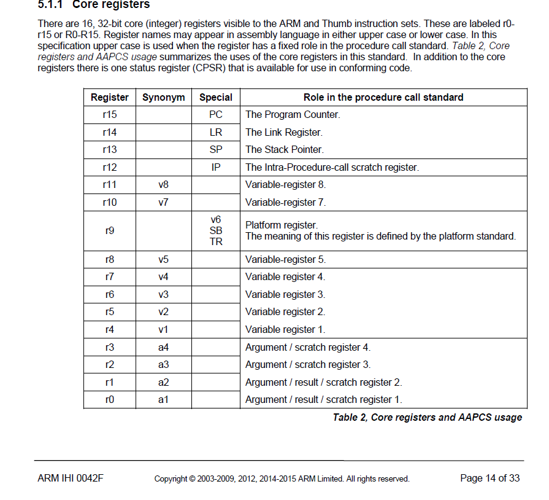
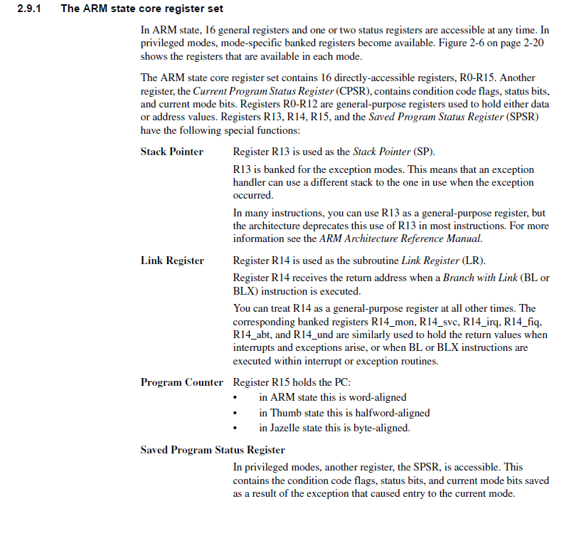
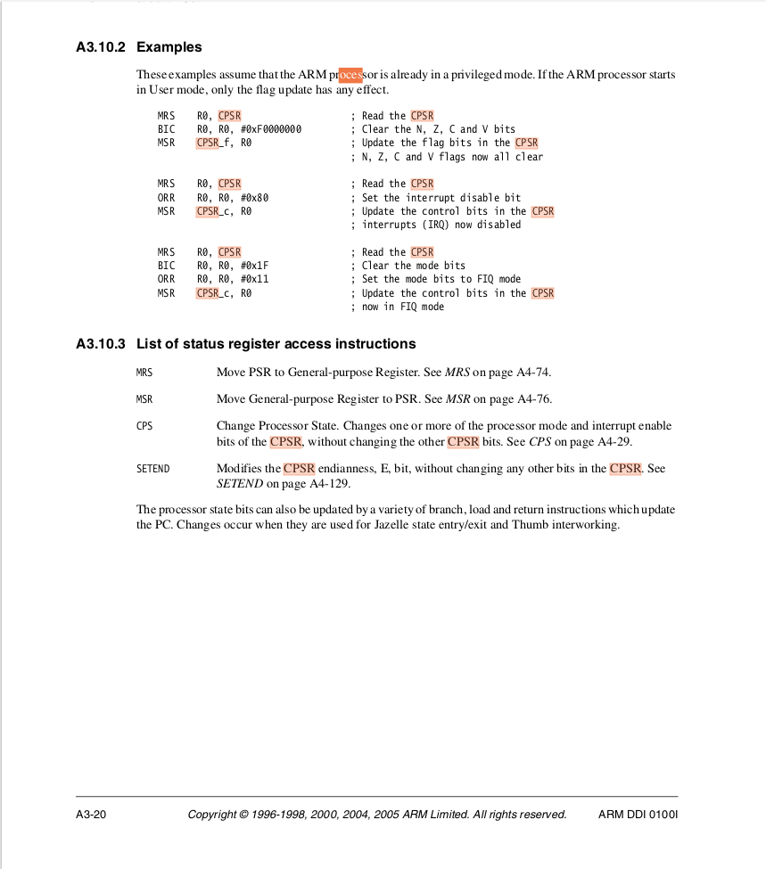
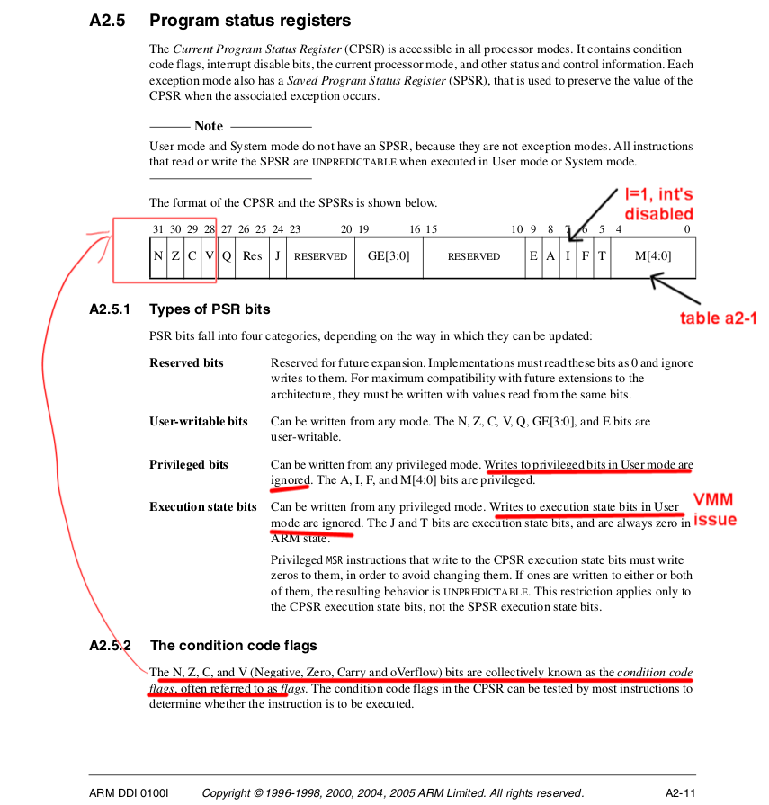
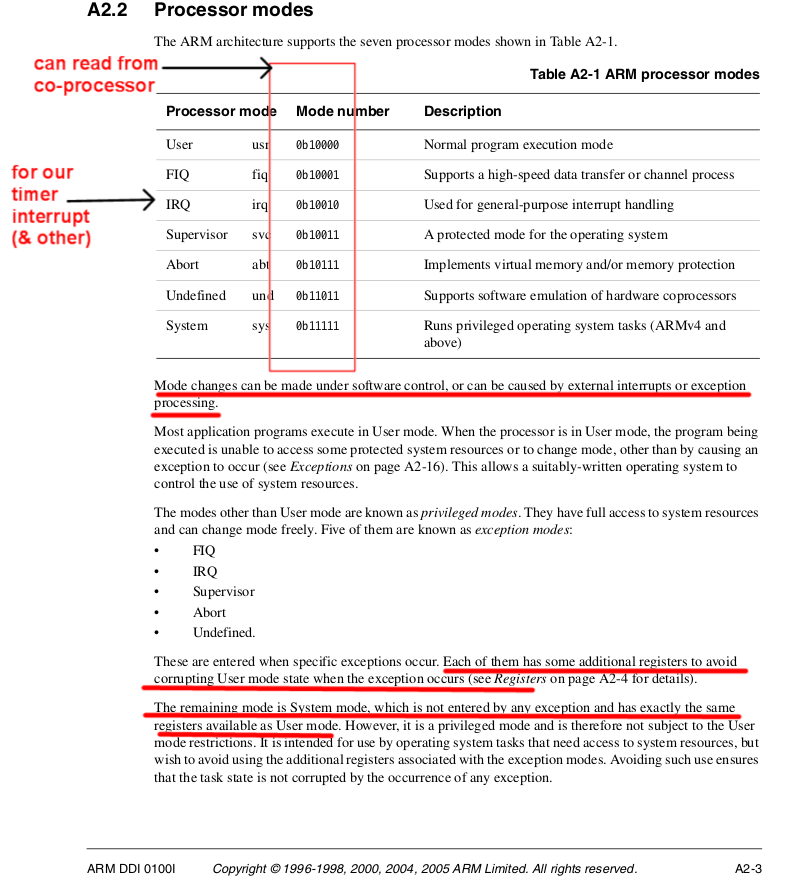
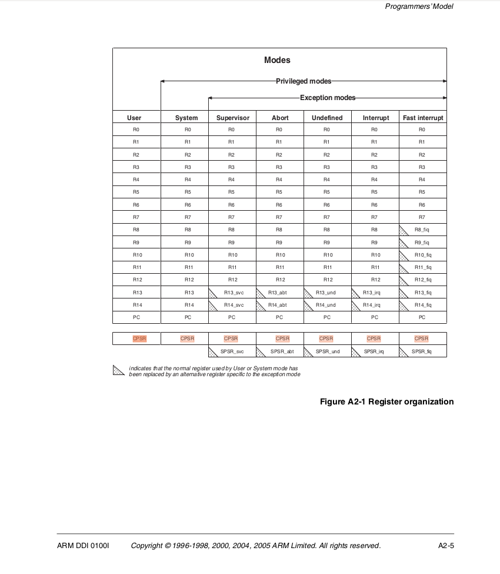
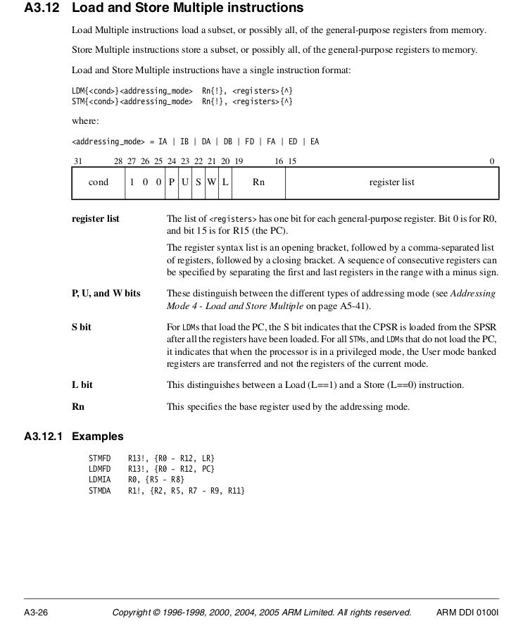

***AM DOING A MASSIVE REWRITE OF THIS.  Will be done in a couple of hours***

## Writing a non-preemptive threads package

Big picture:  by the end of this lab you will have a very simple
round-robin threading package for "cooperative" (i.e., non-preemptive)
threads.

Recall we split threads into two types:

  - Non-preemptive threads run until they explicitly
  yield the processor.

  - Pre-emptive threads only run until interrupted (e.g., by the expiration
  of their time-slice).

Cooperative threads make preserving large invariants easy since, by
default, all code is a critical section, only broken up when you yield
[Atul et al].  Their downside is that if they don't yield "often enough"
they add large, difficult-to-debug latencies.  Pre-emptive threads (we
will do in a subsequent lab) allow you to eliminate the need to trust
that the threading code yields control in a well-behaved way, which is
why   multi-user OSes (Linux and MacOS) preempt user processes.

The main trick for implementing threads of either flavor is *context
switching*:

  1.  Save all thread-specific state for the currently running
   thread `Tcur`.

  2. Load all thread-specific state for a new thread `Tnew`.

  3. Jump to the program counter that `Tnew` was interrupted or yielded at.

For our case, context switching involves saving all registers in a sequence
that you can invert when you jump back to the thread.

Mechanically, context-switching doesn't require much work (say less
than 40 instructions or even fewer using special ARM instructions),
but mistakes can be extremely hard to find.  So we'll break it down into
several smaller pieces.

### Sign-off:

   0. Simple assembly functions that demonstrate your understanding of
   the ARM's load and store instructions (implement and run `part0()`).

   1. A cooperative (non-pre-emptive) context switching implementation
   of the `rpi_yield()` procedure (run `part1()`).

   2. A simple threads system that runs the trivial test in `part2()`,
   plus two additional tests you design.

#### Three possible extensions:

   1. Extension (easy): an implementation of your context switching code
   (from 2) using the ARM `stmfd` and `ldmfd` instructions.

   4. Extension (medium): re-implement your sonar code to have two
   threads, one for PWM of the LED, one for the sonar device thread.
   Make a new `sleep_us(us)` routine that will `rpi_yield()` the processor
   if needed.

   5. Extension (hard): An involuntary (pre-emptive) context switching
   implementation that uses a modification of the timer interrupt
   code from lab 7 to interrupt the current thread, pick a new one
   (round-robin), and jump to it.

----------------------------------------------------------------------
### Background: A crash course in ARM registers

On the ARM, thread-specific state is:

  - Sixteen general-purpose registers `r0`---`r15` which can be saved
  and restored using standard load and store instructions.
  - The current processor status register (`cpsr`), which must be moved
  to and from the coprocessor using special instructions.

ARM general-purpose registers:

   - `r0` --- `r12`: general purpose registers.  

   - `r13` : stack pointer (`sp`).  While you are saving state, you
   will be using the stack pointer `sp`.  Be careful when you save
   this register.  (How to tell if the stack grows up or down?)

   - `r14` : link register (`lr`), holds the address of the instruction
   after the call instruction that called the current code (if any).
   Since each call overwrites `lr`, it must be saved before calling
   another.

   - `r15`: program counter (`pc`).  Writing a value `val` to `pc` causes
   in control to immediately jump to `val`.  (Irrespective of whether
   `addr` points to valid code or not.)  From above: moving `lr` to `pc`
   will return from a call.

Or the [ARM procedure call ABI](http://infocenter.arm.com/help/topic/com.arm.doc.ihi0042f/IHI0042F_aapcs.pdf) document:
<table><tr><td>
  
</td></tr></table>

The link [here](https://azeria-labs.com/arm-data-types-and-registers-part-2/) has a more informal rundown of the above.

##### Caller vs Callee-saved registers.

A nuance: Most machines split registers in into two categories:

  - "Callee-saved": saved and restored code before using it.  If a routine
  `foo` (the caller) calls a routine `bar` (the callee) and `bar` wants
  to use a callee-saved register `r`, it must save `r` before doing so,
  and restore it afterwards.  uses them.

  - "Caller-saved": saved by code if it needs values preserved across
  function calls.  Thus, they can be used without saving/restoring by
  the callee code.

(Why have different types of registers?)

In terms of ARM registers:

  -  `r0` --- `r3` are caller-saved, used to pass the first four
  32-bit integer arguments to procedures.  They are also referred to as
  `a0`---`a3`.

  - `r12` may also be caller-saved, depending on the compiler,
   but I can't find a definitive statement for `arm-none-eabi-gcc`, so
   we will treat it, and all the rest as callee-saved: i.e., they must
   be saved before we can use their contents since the caller assumes
   their values will be preserved across calls.  

You can find a bunch of of information in the ARM Manual:
<table><tr><td>
  
</td></tr></table>

----------------------------------------------------------------------
### Part 0: using assembly to validate your understanding (30 minutes)

This first part makes sure you have the basic tools to validate your
understanding of assembly code by having you write a few assembly
routines.  Being comfortable doing so will come in handy later.

   1. Look up how to get the current `cpsr` in the `docs/armv6.pdf`
   document (I'd suggest section A2-6 or A3) or the screen shot below,
   and write code to do so.  (You can see examples of how to implement
   assembly functions in the `.s` files in the `libpi` directory.)
   Print whether you have interrupts disabled and what mode you are in
   to verify you did so correctly.

   2. Implement a simple assembly routine `test_csave(p,...)` that that
   stores *all* general-purpose registers and the `cpsr` in the pointed-to
   memory `p` using the ARM instruction `str` and explicit constant
   offsets (i.e., there will be one instruction for each register saved)
   and returns a pointer to the last saved value.  Verify that the values
   stored and the amount of space it used makes sense.

   3. Write another version `test_csave_stmfd` using ARM's
   "store multiple", (should be just a few lines)  and verify
   you get the same values as (2).  Note that `stmfd` stores
   registers so that the smallest is at the lowest address.   Useful [ARM
   doc](http://infocenter.arm.com/help/index.jsp?topic=/com.arm.doc.dui0473m/dom1359731152499.html)
   or [this](https://www.heyrick.co.uk/armwiki/STM).

Don't be afraid to go through the ARM manual (`docs/armv6.pdf`)  or the 
lectures we posed in lab7 (`../lab7-interrupts/docs/`).

Examples of `cpsr`:
<table><tr><td>
  
</td></tr></table>

`cpsr` layout:
<table><tr><td>
  
</td></tr></table>

`mode` bits in CPSR:
<table><tr><td>
  
</td></tr></table>

----------------------------------------------------------------------
### Part 1: Cooperative context-switching (20 minutes)

Context switching will involve inverting the code you wrote for Part 0.

  1. Implement `rpi_cswitch(cur,next)` (see `rpi-thread.h`), which saves
  the current registers to `cur`, and loads all the values from `next`.

  2. To make your code easy to test, make sure your `rpi_cswitch`
  code works when you pass the current thread as both arguments ---
  behaviorally this is a no-op since your code should save and restore
  the state, and resume right after the call.

##### A simplification: save all registers.

Strictly speaking, since we are voluntarily context switching we do
not have to save *all* registers, just the "callee-saved" registers
since the code that calls `yield` must have already saved any needed
caller-saved registers.

Since we care about quickly writing a correct, simple threads system we
actually won't make any distinction and will save all registers (the
difference between some loads and stores and some extra if-statements
is negligible).  This makes the context switching for non-pre-emptive
and pre-emptive (next) the same.

----------------------------------------------------------------------
### Part 2: Make simple threads (60 minutes)

Congratulations!  You can now build a simple threading system.

Implement:

  1. `rpi_fork(code, arg)`: to create a new thread, put it on the `runq`.

  2. `rpi_yield()`: yield control to another thread.

  3. `rpi_exit(int)`: kills the current thread.

  4. `rpi_thread_start()`: starts the threading system.

Given that you have context-switching, the main tricky thing is figuring
out how to setup a thread for the first time so that when you run context
switching on it, the right thing will happen (i.e., it will invoke to
`code(arg)`).  The standard way to do this is by manually storing values
onto the thread's stack (sometimes called "brain-surgery") so that when
its state is loaded via `rpi_cswitch` control will jump to a trampoline
routine (written in assembly) with `code` with `arg` in known registers
The trampoline will then branch-and-link to the code with `arg` in
`r0`.  We use a trampoline so that if `code` returns, we can then call
`rpi_thread_exit()`.

While all this is exciting, a major sad is that a single bug can lead
to your code jumping off into hyperspace.  This is hard to debug.
So before you write a bunch of code:

  1. Try to make it into small, simple, testable pieces.

  2. Print all sorts of stuff so you can sanity check!  (e.g., the value
  of the stack pointer, the value of the register you just loaded).
  Don't be afraid to call C code from assembly to do so.

To break down the pieces:

  0. Initially: Have `rpi_thread_start()` just reboot when there are no
  more threads.

  1. Have the trampoline code you write (`rpi_init_trampoline`) initially
  just call out to C code to print out its values so you can sanity check
  that they make sense.

  2. Then only create a single thread and make sure it can run and `rpi_exit`
  explicitly.

  3. Then make sure if it doesn't exit it will do so implicitly.

  4. Then sure it can `rpi_yield` to itself.

  5. Then change `rpi_thread_start()` to create a dummy thread so that
  when there are no more runnable threads, `rpi_cswitch` will transfer
  control back and we can return to its callsite in `part2`.

Congratulations!  Now you have a simple, but working thread implementation
and understand the most tricky part of the code (context-switching)
at a level most CS people do not.

-------------------------------------------------------------------------
### Lab extensions

There's a lot more you can do.  We will be doing a bunch of this later
in the class:

  0. Change all the timer code to use your yield function rather than
  busy wait.  Make sure to check if threads are enabled in `rpi_yield()`!

  1. Have a `sleep_until_us(us)` to put the current thread to sleep with a 
  somewhat hard-deadline that it is woken up in `usec` micro-seconds.  Keep
  track of your cumulative error to see how well you're scheduling is doing.

  2. Rewrite the sonar code to use threads.  Tune your code til it varies
  the light smoothly.

  3. Tune your threads package to be fast.  In particular, you can avoid
  context switching when a thread is run for the first time (there is
  no context to load) and you don't thave to save state when it exits
  (it's done).  You can also try tuning the interrupt handling code,
  since it is at least 2x slower than optimal.  (I'm embarrassed, but
  time = short.  Next year!)

----------------------------------------------------------------------
### Extension (hard) Make pre-emptive threads (60 minutes)

Scheduling threads "pre-emptively" means we interrupt the current running
thread (e.g., pre-empt it with a timer-interrupt) and switch to another
thread *without* requiring the first thread voluntarily yields the CPU.
Pre-emption has the following differences:

  1. You must save *all* registers, not just callee-saved registers,
  since when an interrupt happens all registers are live.  (For this lab
  we don't care about this distinction since we already save everthing.)

  2. Since all registers are live, how do you save them, when you can't
  modify any register?   As discussed in `lab7` the ARM simplifies
  this problem by using "banked registers," where it saves a copy when
  an exception/interrupt occurs.  This helps in that it gives us some
  scratch registers to work with.  It makes state saving a bit more
  complicated since we can't access these registers using our normal
  instructions.  
  In our specific case, we will be in the interrupt handler and cannot
  access the banked copies of registers `r14` and `r15`.  You will have
  to use a special notation to save and restore these.

  3. Similarly, when we save the registers we don't actually have the
  stack pointer of the interrupted thread (it is banked), so  we save
  to a scratch area.

Recall banked registers:
<table><tr><td>
  
</td></tr></table>

And for `ldm` and `stm` you can indicate that the operation works on the
banked registers, not those in the current context using the S bit:
<table><tr><td>
  
</td></tr></table>

In terms of assembler syntax, to save banked copies of registers put a
caret after the register list:

    # ^ tells the assembler to emit S=1, which means we will store the #
    unbanked copies of sp, lr.  stmia sp, {sp, lr}^

#### What to do:

 1. Modify the code in `interrupt-asm.s` to save the entire context
 to the interrupt stack.  **You must save it in the same format as the
 context switch code.**

 2. In the interrupt handler, if you decide to switch to another thread,
 move the values you saved in (1) into the current thread's saved context,
 so that the suspended thread will be switched out correctly.

 3. Make a new copy of the context switching code that you can call from
 the interrupt handler that will correctly return from the interrupt
 and lower the privilege level.

 4. Make sure you `thread-test-both` works.  Write your own code to test
 that you can intermix pre-emptive and non-pre-emptive threads.
